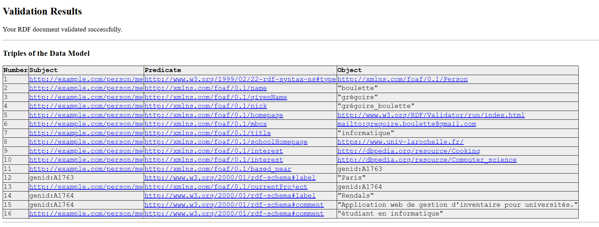

# TP FOAF - Grégory LAISSUS

## Exercice 1 - GitHub

### Contenu FOAF

```xml
<?xml version="1.0" encoding="UTF-8"?>
<rdf:RDF
    xmlns:rdf="http://www.w3.org/1999/02/22-rdf-syntax-ns#"
    xmlns:foaf="http://xmlns.com/foaf/0.1/"
    xmlns:rdfs="http://www.w3.org/2000/01/rdf-schema#">

    <foaf:Person rdf:about="http://example.com/person/me">
        <foaf:name>boulette</foaf:name>
        <foaf:givenName>grégoire</foaf:givenName>
        <foaf:nick>grégoire_boulette</foaf:nick>

        <foaf:homepage rdf:resource="index.html"/>

        <foaf:mbox rdf:resource="mailto:gregoire.boulette@gmail.com"/>

        <foaf:title>informatique</foaf:title>
        <foaf:schoolHomepage rdf:resource="https://www.univ-larochelle.fr/"/>

        <foaf:interest rdf:resource="http://dbpedia.org/resource/Cooking"/>
        <foaf:interest rdf:resource="http://dbpedia.org/resource/Computer_science"/>

        <foaf:based_near>
            <rdf:Description>
                <rdfs:label>Paris</rdfs:label>
            </rdf:Description>
        </foaf:based_near>

        <foaf:currentProject>
            <rdf:Description>
                <rdfs:label>Rendals</rdfs:label>
                <rdfs:comment>Application web de gestion d'inventaire pour universités.</rdfs:comment>
            </rdf:Description>
        </foaf:currentProject>

        <rdfs:comment>étudiant en informatique</rdfs:comment>
    </foaf:Person>

</rdf:RDF>
```

### Liaison

**Lien vers ma page personnelle**

La balise `<foaf:homepage rdf:resource="index.html"/>` relie mon profil FOAF à ma page web personnelle (`index.html`), qui sert de page de présentation. Dans le même cas, on lie notre page html a notre foaf grâce a la balise meta.
`<link rel="meta" type="application/rdf+xml" title="FOAF" href="foaf.rdf" />`

**Validation et dépôt**

Le code est disponible à cette adresse :
[https://github.com/gregorylss/td-foaf-m2](https://github.com/gregorylss/td-foaf-m2).

Ainsi que la homepage : [https://gregorylss.github.io/td-foaf-m2/](https://gregorylss.github.io/td-foaf-m2/)

J'ai également passé dans le validateur W3C.



## Exercice 2 - ORCID

### Récupération des données RDF avec `curl`

Pour obtenir les informations RDF de mon compte ORCID, j’ai utilisé la commande suivante :

```bash
curl -L -H "Accept: application/rdf+xml" https://orcid.org/0009-0007-6764-2445
```

```xml
<rdf:RDF
    xmlns:rdf="http://www.w3.org/1999/02/22-rdf-syntax-ns#"
    xmlns:owl="http://www.w3.org/2002/07/owl#"
    xmlns:prov="http://www.w3.org/ns/prov#"
    xmlns:pav="http://purl.org/pav/"
    xmlns:rdfs="http://www.w3.org/2000/01/rdf-schema#"
    xmlns:gn="http://www.geonames.org/ontology#"
    xmlns:foaf="http://xmlns.com/foaf/0.1/"
    xmlns:xsd="http://www.w3.org/2001/XMLSchema#">
  <foaf:PersonalProfileDocument rdf:about="https://pub.orcid.org/orcid-pub-web/experimental_rdf_v1/0009-0007-6764-2445">
    <pav:createdOn rdf:datatype="http://www.w3.org/2001/XMLSchema#dateTime"
    >2025-09-24T07:14:40.340Z</pav:createdOn>
    <prov:generatedAtTime rdf:datatype="http://www.w3.org/2001/XMLSchema#dateTime"
    >2025-09-24T07:26:06.931Z</prov:generatedAtTime>
    <pav:lastUpdateOn rdf:datatype="http://www.w3.org/2001/XMLSchema#dateTime"
    >2025-09-24T07:26:06.931Z</pav:lastUpdateOn>
    <pav:createdWith rdf:resource="https://orcid.org"/>
    <prov:wasAttributedTo>
      <prov:Person rdf:about="https://orcid.org/0009-0007-6764-2445">
        <foaf:account>
          <foaf:OnlineAccount rdf:about="https://orcid.org/0009-0007-6764-2445#orcid-id">
            <rdfs:label>0009-0007-6764-2445</rdfs:label>
            <foaf:accountName>0009-0007-6764-2445</foaf:accountName>
            <foaf:accountServiceHomepage rdf:resource="https://orcid.org"/>
          </foaf:OnlineAccount>
        </foaf:account>
        <foaf:publications>
          <foaf:Document rdf:about="https://orcid.org/0009-0007-6764-2445#workspace-works"/>
        </foaf:publications>
        <foaf:page rdf:resource="https://gregorylss.github.io/td-foaf-m2/"/>
        <foaf:familyName>Laissus</foaf:familyName>
        <foaf:givenName>Grégory</foaf:givenName>
        <rdfs:label>Grégory Laissus</rdfs:label>
        <rdf:type rdf:resource="http://xmlns.com/foaf/0.1/Person"/>
      </prov:Person>
    </prov:wasAttributedTo>
    <pav:createdBy rdf:resource="https://orcid.org/0009-0007-6764-2445"/>
    <foaf:maker rdf:resource="https://orcid.org/0009-0007-6764-2445"/>
    <foaf:primaryTopic rdf:resource="https://orcid.org/0009-0007-6764-2445"/>
  </foaf:PersonalProfileDocument>
</rdf:RDF>
```

La commande retourne un document RDF/XML contenant :

- Les informations personnelles (nom, prénom, label)
- Les comptes en ligne liés (`foaf:OnlineAccount`)
- Les publications et pages associées
- Les métadonnées de création et mise à jour (via `pav:` et `prov:`)

## Exercice 3 - SolidWeb / Media Kraken

### Contenu RDF de mon profil SolidWeb

Le profil SolidWeb a été récupéré avec la commande `curl` :

```bash
curl -L https://glaissus.solidweb.org/profile/card
```

Ce qui retourne le document RDF suivant :

```turtle
@prefix : <#>.
@prefix foaf: <http://xmlns.com/foaf/0.1/>.
@prefix ldp: <http://www.w3.org/ns/ldp#>.
@prefix rdfs: <http://www.w3.org/2000/01/rdf-schema#>.
@prefix schema: <http://schema.org/>.
@prefix solid: <http://www.w3.org/ns/solid/terms#>.
@prefix space: <http://www.w3.org/ns/pim/space#>.
@prefix pro: <./>.
@prefix inbox: </inbox/>.
@prefix gl: </>.
@prefix res: <http://dbpedia.org/resource/>.
@prefix www: <https://www.univ-larochelle.fr/>.

pro:card a foaf:PersonalProfileDocument;
    foaf:maker :me;
    foaf:primaryTopic :me.

:me
    a schema:Person, foaf:Person;
    rdfs:comment "étudiant en informatique";
    ldp:inbox inbox:;
    space:preferencesFile </settings/prefs.ttl>;
    space:storage gl:;
    solid:account gl:;
    solid:oidcIssuer <https://solidweb.org>;
    solid:privateTypeIndex </settings/privateTypeIndex.ttl>;
    solid:publicTypeIndex </publicTypeIndex.ttl>, </settings/publicTypeIndex.ttl>;
    foaf:based_near [ rdfs:label "Paris" ];
    foaf:currentProject [
        rdfs:comment "Application web de gestion d'inventaire pour universités.";
        rdfs:label "Rendals"
    ];
    foaf:givenName "Grégory";
    foaf:homepage <https://gregorylss.github.io/td-foaf-m2/>;
    foaf:interest res:Computer_science, res:Cooking;
    foaf:name "Laissus";
    foaf:nick "glaissus";
    foaf:schoolHomepage www:;
    foaf:title "informatique".
```

### Utilisation de Media Kraken

Après avoir configuré mon profil SolidWeb, j’ai utilisé **Media Kraken** pour gérer une liste de films.

**Import des films dans SolidWeb**

J’ai importé les films de Media Kraken directement dans mon espace SolidWeb.
La liste est consultable en ligne : [https://glaissus.solidweb.org/movies/](https://glaissus.solidweb.org/movies/).

**Récupération RDF avec `curl`**

Pour obtenir les données RDF des films importés :

```bash
curl -L https://glaissus.solidweb.org/movies/ -o movies.ttl
```

La commande enregistre le contenu RDF/Turtle dans un fichier `movies.ttl`.
Le fichier est disponible sur le dépôt Git, [ici](movies.ttl).
Ce fichier contient les triples RDF représentant chaque film, avec ses propriétés et relations.

## Exercice 4 - LDSpider

### Fichier `seeds.txt`

Ce fichier contient les **URLs de départ** pour le crawling FOAF.

```txt
http://sixhillsconsulting.com/foaf/agueritz/foaf.rdf
https://gregorylss.github.io/td-foaf-m2/
https://glaissus.solidweb.org/profile/card
https://glaissus.solidweb.org/movies
```

La première URL pointe vers un profil FOAF externe (`agueritz`) pour découvrir d’autres personnes FOAF.
Les autres URL pointent vers **mes pages personnelles et mon profil SolidWeb**.

---

### Commande LDSpider

```powershell
java -jar ldspider-1.3-with-dependencies.jar -s seed.txt -b 2 2010 -o foaf-results.nq
```

**Options :**

- `-s seed.txt` → fichier contenant les URLs de départ (mes seeds).
- `-b 2 2010` → crawl en largeur (**breadth-first**) :
- `2` = profondeur maximale pour suivre les liens FOAF à partir des seeds.
- `2010` = limite du nombre d’URIs par domaine (option facultative pour ne pas surcharger le crawl).
- `-o foaf-results.nq` → fichier de sortie contenant tous les triples RDF récupérés au format **N-Quads**, prêt à être analysé ou converti en Turtle.

### Résultat

- LDSpider va explorer **toutes les pages FOAF accessibles à partir de ces seeds**, suivre les liens RDF et collecter les informations sur les personnes et leurs relations.
- Le fichier `foaf-results.nq` contient **tous les triples FOAF récupérés**.
